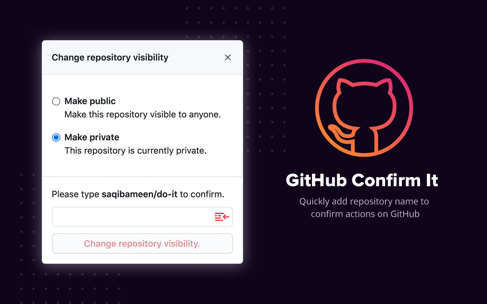

  
   
  

      
      
      
  

# GitHub Confirm It

Quickly add repository name to confirm actions on GitHub with just a single click. It helps you stay productive by saving your time and helping you focus on what matters. Secure and Open Source.

## 🧞‍♂️ Idea

Whenever we have to perform any action in from the Danger Zone section of GitHub repository options, such as:

- Change Visibility
- Transfer Ownership
- Archive Repository
- Delete Repository

It asks to write `username/repository-name`. It's tedious to write it every time you perform any of these actions or want to quickly get done with it. That's why I created this extension, which lets you quickly type that thing for you and perform the action. Just a single click away.

## 🔆 Getting Started

Below are the quick steps to get up and running with this extension.

### 👨‍💻 Installation

Download it from [Chrome Store](https://saqib.dev/gci-chrome). It will add a button inside your input box to quickly insert the text.

### 🎯 In Action

Go to the Settings of your repository, under the Danger Zone heading, click on any action. You'll notice the small insert text icon in your input. Click on it to insert the text. A quick GIF for you:

## 📋 Permissions

Only requires `content_script` permission which only run on the settings page of your repository.

## 👋 Say Hi

Let's connect. Say Hi on Twitter [@saqibameen](https://twitter.com/saqibameen).
